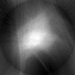

MIC TOOLS
#########

**Mic Tools** contains a list of python tools to interface X-ray Fluorescence (XRF) data collected at the Advanced Photon Source Microscopy beamlines 2-ID-E and the Bio Nano Probe with `tomoPy <https://tomopy.readthedocs.io/en/latest/>`_

Convert
=======

* Reads 2-ID-E and Bio Nano Probe HDF data and converts in a stack of tiff or in a single hdf file formatted as a `tomographic data exchange <https://dxfile.readthedocs.io/en/latest/source/xraytomo.html>`_ that can be directly loaded and reconstructed by tomopy with `rec.py <https://github.com/decarlof/util/tree/master/xrf>`_. XRF data can also be aligned with `align_seq or align_joint <https://tomopy.readthedocs.io/en/latest/api/tomopy.prep.alignment.html#>`_
* Tested with `2-ID-E data <https://anl.box.com/s/qinted32vyrcnjyt7tzs3cx6kreeud3m>`_

Help::
    
    python convert.py -h

Usage::
    
    convert.py [-h] [--element [ELEMENT]]
                     [--output_fname [OUTPUT_FNAME]]
                     [--output_fformat [OUTPUT_FFORMAT]]
                     [--theta_index [THETA_INDEX]]
                     fname

positional arguments::

  fname                 directory containing multiple datasets or file name of
                        a single dataset: /data/ or /data/sample.h5

optional arguments::

  -h, --help            show this help message and exit
  --element [ELEMENT]   element selection (default Si)
  --output_fname [OUTPUT_FNAME]
                        output file path and prefix (default ./data)
  --output_fformat [OUTPUT_FFORMAT]
                        output file format: hdf or tiff (default hdf)
  --theta_index [THETA_INDEX]
                        theta_index: 2-ID-E: 663; 2-ID-E prior 2017: 657; BNP
                        8; (default 657)

Example::

    python convert.py mic_data/  (<= full path to the directory containing the datasets)
    python convert.py --element Ca --output_fformat hdf mic_data/

Reconstruct XRF data with tomoPy
================================

The hdf files generated by convert.py cannot be directly reconstructed by tomoPy using for 
example the standard `rec.py <https://github.com/decarlof/util/tree/master/xrf>`_ 

::

    python rec.py(*) data.h5(**)
    python rec.py --axis 90.5 data.h5

from `here <https://github.com/decarlof/util/tree/master/xrf>`_, in fact the resulting 
reconstruction will look like this:

Align XRF data for tomoPy
=========================

To correcly reconstruct the hdf files generated by convert.py is necessary to align the 
projections with `align.py <https://github.com/decarlof/util/tree/master/xrf>`_:

::

    python align.py /data/

`align.py <https://github.com/decarlof/util/tree/master/xrf>`_ uses the tomopy funciton 
`align_joint <https://tomopy.readthedocs.io/en/stable/api/tomopy.prep.alignment.html#tomopy.prep.alignment.align_joint>`_.

The aligned projections generate the following reconstructed slice:

(**) `data.h5 <https://anl.box.com/s/ob67h13ue5meydzq71n8it38wbl6oh2y>`_

(***) `align.py <https://github.com/decarlof/util/tree/master/xrf>`_

